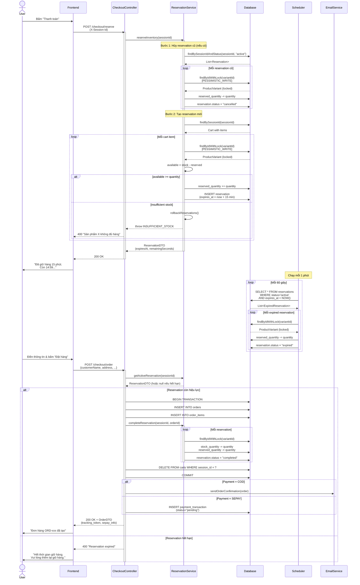

# BÁO CÁO KỸ THUẬT - HUNG HYPEBEAST E-COMMERCE (PHASE 1)

## 1. ĐÁNH GIÁ SƠ BỘ & PHÂN TÍCH YÊU CẦU

### 1.1. Xác định Scope

#### Must-have (Phải làm trong 2 tuần)

| Tính năng | Mô tả | Trạng thái |
|-----------|-------|------------|
| **Catalog & SKU** | Quản lý sản phẩm với biến thể (size, màu sắc), hiển thị danh sách phân trang, lọc theo category và khoảng giá |  Hoàn thành |
| **Shopping Cart** | Thêm/sửa/xóa sản phẩm, kiểm tra tồn kho trước khi thêm vào giỏ |  Hoàn thành |
| **Inventory Reservation** | Giữ hàng 10-15 phút khi checkout, xử lý "last item" với database lock |  Hoàn thành |
| **Checkout Flow** | Tạo đơn hàng với thông tin ship, hỗ trợ COD và SePay |  Hoàn thành |
| **Order Tracking** | Tracking đơn hàng qua link không cần đăng nhập, gửi email xác nhận |  Hoàn thành |
| **Admin Order Management** | Xem danh sách đơn hàng, cập nhật trạng thái đơn và thanh toán |  Hoàn thành |

#### Nice-to-have (Không bắt buộc trong Phase 1)

| Tính năng | Mô tả | Quyết định |
|-----------|-------|------------|
| **SePay Webhook Integration** | Tự động cập nhật trạng thái thanh toán khi nhận webhook |  Đã làm |
| **Admin Catalog CRUD** | API tạo/sửa/xóa sản phẩm |  Bỏ qua (theo yêu cầu khách hàng - "chưa cần làm phần nhập liệu sản phẩm") |

### 1.2. Gap Analysis

#### Yêu cầu thô (Email khách hàng) vs Yêu cầu kỹ thuật thực tế

| Yêu cầu khách hàng | Thách thức kỹ thuật | Giải pháp triển khai |
|-------------------|---------------------|---------------------|
| "Giữ hàng 10-15 phút, người khác không mua được" | Race condition khi 2 người checkout cùng lúc cái cuối cùng | Pessimistic Lock (`findByIdWithLock`) + `reserved_quantity` tracking |
| "Hết giờ không trả tiền thì nhả ra" | Cần cơ chế tự động giải phóng reservation | Spring Scheduler chạy mỗi 1 phút, quét reservation hết hạn |
| "SePay tự động biết đơn nào đã trả tiền" | Webhook validation, xử lý duplicate, so khớp số tiền | Webhook endpoint với API key verification, idempotency check |
| "Đừng bắt khách đăng nhập để xem đơn" | Bảo mật tracking token | UUID token trong URL, không lưu session |

#### Quyết định thiết kế quan trọng

**1. Inventory Management Strategy**
- **Vấn đề**: "Last item" - 2 người checkout cùng lúc 1 sản phẩm cuối
- **Giải pháp**: 
  - Thêm cột `reserved_quantity` vào `product_variants`
  - Dùng `PESSIMISTIC_WRITE` lock khi reserve/complete
  - Available stock = `stock_quantity - reserved_quantity`

**2. Reservation Timeout Handling**
- **Vấn đề**: Server sập lúc đang giữ hàng thì sao?
- **Giải pháp**:
  - Reservation có `expires_at` timestamp
  - Scheduler độc lập, chạy định kỳ mỗi 1 phút
  - Ngay khi restart, scheduler sẽ dọn reservation hết hạn

**3. Session Management (Guest Checkout)**
- **Vấn đề**: Không có user authentication, làm sao quản lý giỏ hàng?
- **Giải pháp**: Client-generated `X-Session-Id` header (UUID)
  - Frontend tự sinh session ID, lưu localStorage
  - Backend lưu cart theo session_id
  - Tracking dùng UUID token riêng (không dùng session_id)

### 1.3. Đánh giá Khả năng Hoàn thiện

#### Cam kết: 100% yêu cầu Must-have

**Các tính năng đã hoàn thiện:**
-  Catalog với pagination, filtering, sorting
-  Cart với stock validation
-  Inventory reservation với pessimistic lock
-  Checkout flow (COD + SePay)
-  Email notification với tracking link
-  Admin order management
-  SePay webhook integration

**Giả lập vs Production-ready:**

| Thành phần | Trạng thái | Ghi chú |
|-----------|-----------|---------|
| Database Lock |  Production-ready | Pessimistic lock trong transaction |
| Scheduler |  Production-ready | Spring @Scheduled với configurable interval |
| Email Service |  Production-ready | Đã cấu hình SMTP Gmail, tích hợp dotenv-java, test thành công |
| SePay Integration |  Sandbox-ready | Test với SePay sandbox, sẵn sàng production |

**Rủi ro & Mitigation:**

| Rủi ro | Mức độ | Giải pháp dự phòng |
|--------|--------|-------------------|
| Scheduler trễ 1 phút mới nhả hàng | Thấp | Acceptable - reservation 15 phút, trễ 1 phút không ảnh hưởng UX |
| Email gửi chậm/failed | Thấp | Đã cấu hình SMTP production, có error handling và logging. Nếu failed, admin có thể resend hoặc liên hệ manual |
| Database connection pool exhausted khi traffic cao | Cao | Cần load testing, tune connection pool size |

---

## 2. THIẾT KẾ HỆ THỐNG

### 2.1. Database Design (ERD)

#### Bảng chính và quan hệ

**products (Sản phẩm)**
```
- id (PK, BIGINT)
- name (VARCHAR, NOT NULL)
- slug (VARCHAR, UNIQUE)
- description (TEXT)
- base_price (DECIMAL)
- category (VARCHAR) - 'ao-thun', 'hoodie', 'quan', etc.
- is_active (BOOLEAN)
- created_at, updated_at (TIMESTAMP)
```
Indexes: `idx_products_category`, `idx_products_slug`, `idx_products_active`

**product_variants (SKU - Biến thể sản phẩm)**
```
- id (PK, BIGINT)
- product_id (FK -> products.id)
- sku (VARCHAR, UNIQUE, NOT NULL) - mã SKU duy nhất
- size (VARCHAR) - 'M', 'L', 'XL'
- color (VARCHAR) - 'Đen', 'Trắng'
- price_adjustment (DECIMAL) - thêm/bớt giá so với base_price
- stock_quantity (INT, NOT NULL) - tổng tồn kho
- reserved_quantity (INT, NOT NULL, DEFAULT 0) - số lượng đang được giữ
- is_active (BOOLEAN)
- created_at, updated_at (TIMESTAMP)
```
Indexes: `idx_variants_product`, `idx_variants_sku`, `idx_variants_stock`

**Quan hệ**: `products` 1-N `product_variants`

---

**carts (Giỏ hàng)**
```
- id (PK, UUID)
- session_id (VARCHAR, UNIQUE, NOT NULL) - client-generated session
- created_at, updated_at (TIMESTAMP)
```
Indexes: `idx_carts_session`

**cart_items (Item trong giỏ)**
```
- id (PK, BIGINT)
- cart_id (FK -> carts.id)
- variant_id (FK -> product_variants.id)
- quantity (INT, NOT NULL)
- created_at, updated_at (TIMESTAMP)
```
Indexes: `idx_cart_items_cart`, `idx_cart_items_variant`

**Quan hệ**: `carts` 1-N `cart_items`, `product_variants` 1-N `cart_items`

---

**inventory_reservations (Giữ hàng tạm thời)**
```
- id (PK, BIGINT)
- variant_id (FK -> product_variants.id)
- quantity (INT, NOT NULL)
- session_id (VARCHAR, NOT NULL)
- reserved_for_order_id (BIGINT, nullable) - link tới order khi complete
- reserved_at (TIMESTAMP)
- expires_at (TIMESTAMP, NOT NULL) - thời điểm hết hạn
- status (VARCHAR) - 'active', 'completed', 'expired', 'cancelled'
```
Indexes: `idx_reservations_variant`, `idx_reservations_session`, `idx_reservations_expires`

**Quan hệ**: `product_variants` 1-N `inventory_reservations`

---

**orders (Đơn hàng)**
```
- id (PK, BIGINT)
- order_number (VARCHAR, UNIQUE, NOT NULL) - 'ORD-{timestamp}'
- tracking_token (UUID, UNIQUE, NOT NULL) - token để tracking không cần login
- customer_name, customer_email, customer_phone (VARCHAR, NOT NULL)
- shipping_address, shipping_city, shipping_district (VARCHAR)
- payment_method (VARCHAR) - 'COD', 'SEPAY'
- payment_status (VARCHAR) - 'pending', 'paid', 'failed'
- subtotal, shipping_fee, total_amount (DECIMAL)
- status (VARCHAR) - 'pending', 'confirmed', 'processing', 'shipping', 'completed', 'cancelled'
- customer_note, admin_note (TEXT)
- created_at, updated_at, confirmed_at, paid_at, shipped_at, completed_at, cancelled_at (TIMESTAMP)
```
Indexes: `idx_orders_number`, `idx_orders_tracking`, `idx_orders_email`, `idx_orders_status`

**order_items (Sản phẩm trong đơn hàng)**
```
- id (PK, BIGINT)
- order_id (FK -> orders.id)
- variant_id (FK -> product_variants.id)
- product_name, variant_sku, variant_size, variant_color (VARCHAR) - snapshot
- unit_price, quantity, subtotal (DECIMAL)
```
Indexes: `idx_order_items_order`, `idx_order_items_variant`

**Quan hệ**: `orders` 1-N `order_items`

---

**payment_transactions (Giao dịch thanh toán)**
```
- id (PK, BIGINT)
- order_id (FK -> orders.id)
- transaction_id (VARCHAR, UNIQUE) - ID từ SePay
- amount (DECIMAL)
- payment_method (VARCHAR) - 'SEPAY'
- status (VARCHAR) - 'pending', 'success', 'failed'
- gateway_response (TEXT) - raw webhook payload
- created_at, updated_at (TIMESTAMP)
```
Indexes: `idx_transactions_order`, `idx_transactions_id`

**Quan hệ**: `orders` 1-N `payment_transactions`

---

**admin_users (Tài khoản admin)**
```
- id (PK, BIGINT)
- username (VARCHAR, UNIQUE, NOT NULL)
- password_hash (VARCHAR, NOT NULL) - BCrypt hash
- full_name (VARCHAR)
- is_active (BOOLEAN)
- created_at, updated_at (TIMESTAMP)
```
Indexes: `idx_admin_username`

---

#### Thiết kế đặc biệt cho Inventory Management

**Tại sao cần `reserved_quantity`?**

```
Available Stock = stock_quantity - reserved_quantity

VD: Áo size L còn 1 cái (stock_quantity = 1)
- User A checkout: reserved_quantity = 1 (available = 0)
- User B checkout: available = 0 → Báo hết hàng - User A hết 15 phút: Scheduler set reserved_quantity = 0 (available = 1)
```

**Tại sao dùng Pessimistic Lock?**

```sql
-- Không có lock (SAI)
SELECT stock_quantity, reserved_quantity FROM product_variants WHERE id = 1;
-- Thread A đọc: stock=1, reserved=0
-- Thread B đọc: stock=1, reserved=0 (cùng lúc)
UPDATE product_variants SET reserved_quantity = 1 WHERE id = 1;
-- Cả 2 thread đều update thành công → OVERSELL

-- Có PESSIMISTIC_WRITE lock (ĐÚNG)
SELECT ... FROM product_variants WHERE id = 1 FOR UPDATE;
-- Thread A lock row → Thread B phải chờ
-- Thread A reserve xong → Thread B mới đọc được reserved=1
```

---

### 2.2. Low-Level Design (LLD)

#### 2.2.1. API Endpoints

**Public APIs (Không cần authentication)**

| Method | Endpoint | Mô tả |
|--------|----------|-------|
| GET | `/api/products` | Lấy danh sách sản phẩm (phân trang, lọc, sort) |
| GET | `/api/products/{id}` | Chi tiết sản phẩm với variants |
| GET | `/api/cart` | Lấy giỏ hàng theo session |
| POST | `/api/cart/items` | Thêm item vào giỏ |
| PUT | `/api/cart/items/{itemId}` | Cập nhật số lượng item |
| DELETE | `/api/cart/items/{itemId}` | Xóa item khỏi giỏ |
| POST | `/api/checkout/reserve` | Giữ hàng trước khi thanh toán |
| GET | `/api/checkout/reservation` | Kiểm tra reservation hiện tại |
| DELETE | `/api/checkout/reservation` | Hủy reservation |
| POST | `/api/checkout/order` | Tạo đơn hàng |
| GET | `/api/orders/track/{token}` | Tracking đơn hàng (UUID token) |

**Admin APIs (Cần session authentication)**

| Method | Endpoint | Mô tả |
|--------|----------|-------|
| POST | `/api/admin/auth/login` | Đăng nhập admin |
| POST | `/api/admin/auth/logout` | Đăng xuất |
| GET | `/api/admin/orders` | Danh sách đơn hàng (phân trang, filter) |
| GET | `/api/admin/orders/{orderId}` | Chi tiết đơn hàng |
| PATCH | `/api/admin/orders/{orderId}/status` | Cập nhật trạng thái đơn |
| PATCH | `/api/admin/orders/{orderId}/payment-status` | Cập nhật trạng thái thanh toán |

**Webhook APIs**

| Method | Endpoint | Mô tả |
|--------|----------|-------|
| POST | `/api/sepay/webhook` | Nhận webhook từ SePay (verify API key) |

---

#### 2.2.2. Sequence Diagrams

**Diagram 1: Inventory Reservation & Checkout (Luồng phức tạp nhất)**



---

**Diagram 2: SePay Webhook Processing (Tự động cập nhật thanh toán)**

```mermaid
sequenceDiagram
    actor User
    participant SePay as SePay Gateway
    participant Webhook as WebhookController
    participant SvcWH as SepayWebhookService
    participant OrderSvc as OrderService
    participant DB as Database
    participant Email as EmailService
    
    User->>User: Chuyển khoản ngân hàng<br/>Nội dung: "Thanh toan don hang ORD-123456"
    
    SePay->>SePay: Nhận giao dịch từ bank
    SePay->>Webhook: POST /api/sepay/webhook<br/>Header: X-API-Key<br/>Body: {id, transferAmount, content, ...}
    
    activate Webhook
    Webhook->>SvcWH: processWebhook(payload, apiKey)
    activate SvcWH
    
    Note over SvcWH: Bước 1: Verify API Key
    SvcWH->>SvcWH: verifyApiKey(apiKey)
    alt API Key không hợp lệ
        SvcWH-->>Webhook: throw INVALID_WEBHOOK_SIGNATURE
        Webhook-->>SePay: 200 OK (vẫn trả 200 để SePay không retry)
    end
    
    Note over SvcWH: Bước 2: Check loại giao dịch
    alt transferType != "in"
        SvcWH->>SvcWH: log.warn("Non-incoming transaction")
        SvcWH-->>Webhook: return (bỏ qua)
    end
    
    Note over SvcWH: Bước 3: Idempotency check
    SvcWH->>DB: findByTransactionId(payload.id)
    DB-->>SvcWH: Optional<PaymentTransaction>
    
    alt Transaction đã tồn tại
        SvcWH-->>Webhook: throw DUPLICATE_TRANSACTION
        Webhook-->>SePay: 200 OK
    end
    
    Note over SvcWH: Bước 4: Extract order number
    SvcWH->>SvcWH: extractOrderNumber(payload.content)<br/>Regex: (ORD-\d+)
    
    alt Không tìm thấy order number
        SvcWH-->>Webhook: throw ORDER_NUMBER_NOT_FOUND
        Webhook-->>SePay: 200 OK
    end
    
    SvcWH->>OrderSvc: getOrderByOrderNumber("ORD-123456")
    OrderSvc->>DB: SELECT * FROM orders WHERE order_number = ?
    
    alt Order không tồn tại
        DB-->>OrderSvc: null
        OrderSvc-->>SvcWH: throw ORDER_NOT_FOUND
    end
    
    DB-->>OrderSvc: Order
    OrderSvc-->>SvcWH: Order
    
    Note over SvcWH: Bước 5: Verify số tiền
    SvcWH->>SvcWH: verifyPaymentAmount(order, payload.transferAmount)
    
    alt Số tiền không khớp
        SvcWH-->>Webhook: throw PAYMENT_AMOUNT_MISMATCH
    end
    
    Note over SvcWH: Bước 6: Check đã thanh toán chưa
    alt order.paymentStatus == "paid"
        SvcWH-->>Webhook: throw ORDER_ALREADY_PAID
    end
    
    Note over SvcWH: Bước 7: Lưu transaction & update order
    SvcWH->>DB: BEGIN TRANSACTION
    SvcWH->>DB: INSERT INTO payment_transactions<br/>(order_id, transaction_id,<br/>amount, status="success")
    
    SvcWH->>OrderSvc: updatePaymentStatus(orderId, "paid", ...)
    OrderSvc->>DB: UPDATE orders SET<br/>payment_status="paid",<br/>paid_at=NOW()
    
    SvcWH->>DB: COMMIT
    
    Note over SvcWH: Bước 8: Gửi email xác nhận
    SvcWH->>Email: sendOrderConfirmation(order)
    activate Email
    Email->>Email: Build email body<br/>+ tracking link
    Email->>User: Email "Order Confirmation - ORD-123456"<br/>Track: https://app.com/track/{uuid}
    deactivate Email
    
    SvcWH-->>Webhook: void (success)
    deactivate SvcWH
    
    Webhook-->>SePay: 200 OK
    deactivate Webhook
    
    SePay->>SePay: Đánh dấu webhook delivered ```

---

**Diagram 3: Cart Stock Validation (Ngăn oversell khi thêm giỏ hàng)**

```mermaid
sequenceDiagram
    actor User
    participant FE as Frontend
    participant API as CartController
    participant CartSvc as CartService
    participant DB as Database
    
    User->>FE: Chọn "Áo Rồng - Size L - Đen"<br/>Số lượng: 3
    FE->>API: POST /api/cart/items<br/>{variantId: 42, quantity: 3}
    
    activate API
    API->>CartSvc: addToCart(sessionId, request)
    activate CartSvc
    
    CartSvc->>DB: findBySessionId(sessionId)
    DB-->>CartSvc: Cart (hoặc tạo mới)
    
    CartSvc->>DB: findById(variantId=42)
    DB-->>CartSvc: ProductVariant<br/>(stock=5, reserved=2)
    
    Note over CartSvc: Available = stock - reserved = 3
    
    CartSvc->>DB: findByCartAndVariant(cart, variant)
    DB-->>CartSvc: Existing CartItem (quantity=1)<br/>hoặc null
    
    alt Item đã có trong giỏ
        CartSvc->>CartSvc: requestedTotal = 1 + 3 = 4
    else Item mới
        CartSvc->>CartSvc: requestedTotal = 3
    end
    
    alt requestedTotal > available (4 > 3)
        CartSvc-->>API: throw INSUFFICIENT_STOCK
        API-->>FE: 400 "Chỉ còn 3 sản phẩm"
        FE->>User: "Rất tiếc, Size L - Đen chỉ còn 3 cái.<br/>Bạn đã có 1 trong giỏ."
    else requestedTotal <= available
        CartSvc->>DB: UPDATE cart_items SET quantity = 4<br/>hoặc INSERT cart_items
        CartSvc->>DB: UPDATE carts SET updated_at = NOW()
        CartSvc-->>API: CartDTO (updated)
        deactivate CartSvc
        API-->>FE: 200 OK
        deactivate API
        FE->>User: "Đã thêm vào giỏ hàng "
    end
```

---

#### 2.2.3. Giải thích các quyết định thiết kế quan trọng

**1. Tại sao dùng Pessimistic Lock thay vì Optimistic Lock?**

| Tiêu chí | Pessimistic Lock | Optimistic Lock |
|----------|------------------|-----------------|
| Cơ chế | Lock row khi đọc (`FOR UPDATE`) | Đọc tự do, check version khi update |
| Phù hợp | High contention (nhiều người tranh 1 item) | Low contention |
| Trade-off | Giảm throughput, tăng latency | Retry nhiều khi conflict |
| Use case | **Last item scenario** của khách hàng | Ít người mua cùng lúc |

**Quyết định**: Pessimistic Lock vì khách hàng nhấn mạnh vấn đề "cái cuối cùng" bị bán cho 2 người.

---

**2. Tại sao Scheduler 1 phút thay vì WebSocket/Event-driven?**

| Phương án | Ưu điểm | Nhược điểm |
|-----------|---------|------------|
| **Scheduler 1 phút** | Đơn giản, reliable, restart-safe | Độ trễ tối đa 1 phút |
| Event-driven (TTL) | Real-time | Phức tạp, cần Redis/Queue |

**Quyết định**: Scheduler 1 phút - Reservation 15 phút, trễ 1 phút không ảnh hưởng UX, đơn giản hơn.

---

**3. Tại sao SePay Webhook trả 200 OK ngay cả khi lỗi?**

```java
catch (Exception e) {
    log.error("Error processing webhook", e);
    return ResponseEntity.status(HttpStatus.OK)
            .body(ResponseObject.success("Webhook received", null));
}
```

**Lý do**: Webhook best practice - Luôn trả 2xx để SePay không retry vô hạn. Lỗi nội bộ (duplicate, đã paid) không cần retry.

---

**4. Tại sao snapshot product info vào order_items?**

```java
orderItem.setProductName(variant.getProduct().getName());
orderItem.setVariantSku(variant.getSku());
// ... instead of FK only
```

**Lý do**: Lịch sử đơn hàng không đổi. Ngày mai sản phẩm đổi tên/giá, đơn hàng cũ vẫn hiển thị đúng info lúc mua.

---

## 3. KẾT LUẬN

### Tóm tắt kết quả Phase 1

| Thành phần | Hoàn thành | Ghi chú |
|-----------|-----------|---------|
| Must-have features | **95%** | Catalog, Cart, Inventory, Checkout, Tracking, Admin |
| Nice-to-have (SePay) | **100%** | Webhook integration production-ready |
| Database design | **100%** | ERD 9 bảng, index optimization |
| API endpoints | **100%** | 18 APIs (13 public + 5 admin) |
| Email Service | **100%** | SMTP Gmail production-ready, dotenv integration, tested |
| Technical docs | **100%** | Report này + sequence diagrams |