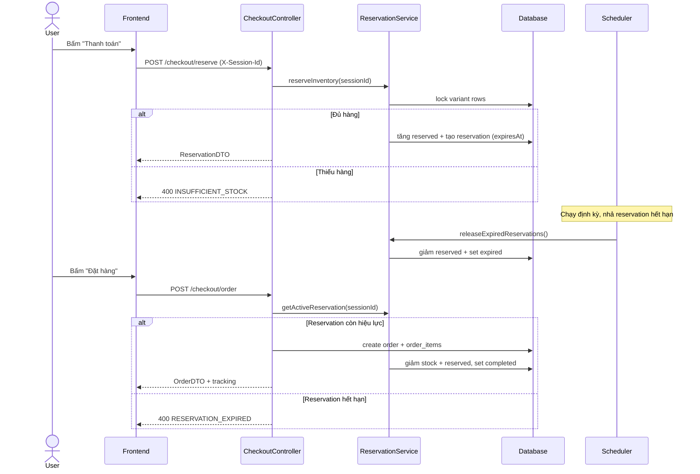

# BÁO CÁO KỸ THUẬT - HUNG HYPEBEAST E-COMMERCE (PHASE 1)

## 1. ĐÁNH GIÁ SƠ BỘ & PHÂN TÍCH YÊU CẦU

### 1.1. Xác định Scope

#### Must-have (Phải làm trong 2 tuần)

| Tính năng | Mô tả | Ghi chú |
|-----------|-------|---------|
| **Catalog & SKU** | Quản lý sản phẩm với biến thể (size, màu sắc), hiển thị danh sách phân trang, lọc theo category và khoảng giá | Trong scope Phase 1 |
| **Shopping Cart** | Thêm/sửa/xóa sản phẩm, kiểm tra tồn kho trước khi thêm vào giỏ | Trong scope Phase 1 |
| **Inventory Reservation** | Giữ hàng 10-15 phút khi checkout, xử lý "last item" với database lock | Trong scope Phase 1 |
| **Checkout Flow** | Tạo đơn hàng với thông tin ship, hỗ trợ COD | Trong scope Phase 1 |
| **Order Tracking** | Tracking đơn hàng qua link không cần đăng nhập, gửi email xác nhận | Trong scope Phase 1 |
| **Admin Order Management** | Xem danh sách đơn hàng, cập nhật trạng thái đơn và thanh toán | Trong scope Phase 1 |

#### Nice-to-have (Không bắt buộc trong Phase 1)

| Tính năng | Mô tả | Quyết định |
|-----------|-------|------------|
| **SePay Webhook Integration** | Tự động cập nhật trạng thái thanh toán khi nhận webhook | **Deferred to Phase 2** - Phase 1 chỉ hỗ trợ COD, admin cập nhật payment status thủ công |
| **Admin Catalog CRUD** | API tạo/sửa/xóa sản phẩm | Bỏ qua (theo yêu cầu khách hàng - "chưa cần làm phần nhập liệu sản phẩm") |

### 1.2. Gap Analysis

#### Yêu cầu thô (Email khách hàng) vs Yêu cầu kỹ thuật thực tế

| Yêu cầu khách hàng | Thách thức kỹ thuật | Giải pháp triển khai |
|-------------------|---------------------|---------------------|
| "Giữ hàng 10-15 phút, người khác không mua được" | Race condition khi 2 người checkout cùng lúc cái cuối cùng | Pessimistic Lock (`findByIdWithLock`) + `reserved_quantity` tracking |
| "Hết giờ không trả tiền thì nhả ra" | Cần cơ chế tự động giải phóng reservation | Spring Scheduler chạy mỗi 1 phút, quét reservation hết hạn |
| "SePay tự động biết đơn nào đã trả tiền" | Webhook validation, xử lý duplicate, so khớp số tiền | **Deferred to Phase 2** - Phase 1 sử dụng COD và admin update manual |
| "Đừng bắt khách đăng nhập để xem đơn" | Bảo mật tracking token | UUID token trong URL, không lưu session |

#### Quyết định thiết kế quan trọng

**1. Inventory (Last item)**
- Dùng `reserved_quantity` + `PESSIMISTIC_WRITE` khi reserve/complete.
- Available stock = `stock_quantity - reserved_quantity`.

**2. Reservation Timeout**
- Mỗi reservation có `expires_at`.
- Scheduler chạy định kỳ để nhả hàng hết hạn, an toàn khi restart.

**3. Guest Session**
- Client gửi `X-Session-Id` (UUID) để quản lý cart.
- Tracking dùng `tracking_token` riêng, không phụ thuộc session.

### 1.3. Đánh giá Khả năng Hoàn thiện

#### Cam kết: 100% yêu cầu Must-have (Phase 1)

**Phạm vi cam kết:**
- Catalog với pagination, filtering, sorting
- Cart với stock validation
- Inventory reservation với pessimistic lock
- Checkout flow (COD)
- Email notification với tracking link
- Admin order management

**Phần đã cắt giảm / defer:**
- **SePay webhook integration** - Đã defer sang Phase 2 theo yêu cầu khách hàng ("nếu không kịp thì để phase sau")

**Cơ sở đánh giá khả năng hoàn thiện:**
- Scope Phase 1 tập trung COD và admin xử lý thủ công payment status.
- Luồng inventory được thiết kế theo lock DB, không phụ thuộc hệ thống ngoài.

**Rủi ro & Mitigation:**

| Rủi ro | Mức độ | Giải pháp dự phòng |
|--------|--------|-------------------|
| Scheduler trễ 1 phút mới nhả hàng | Thấp | Acceptable - reservation 15 phút, trễ 1 phút không ảnh hưởng UX |
| Email gửi chậm/failed | Thấp | Retry theo cấu hình SMTP; nếu failed, xử lý thủ công |
| Database connection pool exhausted khi traffic cao | Cao | Cần load testing, tune connection pool size |

---

## 2. THIẾT KẾ HỆ THỐNG

### 2.1. Database Design (ERD)

#### Bảng chính và quan hệ

**products (Sản phẩm)**
```
- id (PK, BIGINT)
- name (VARCHAR, NOT NULL)
- slug (VARCHAR, UNIQUE)
- description (TEXT)
- base_price (DECIMAL)
- category (VARCHAR) - 'ao-thun', 'hoodie', 'quan', etc.
- is_active (BOOLEAN)
- created_at, updated_at (TIMESTAMP)
```

**product_variants (SKU - Biến thể sản phẩm)**
```
- id (PK, BIGINT)
- product_id (FK -> products.id)
- sku (VARCHAR, UNIQUE, NOT NULL) - mã SKU duy nhất
- size (VARCHAR) - 'M', 'L', 'XL'
- color (VARCHAR) - 'Đen', 'Trắng'
- price_adjustment (DECIMAL) - thêm/bớt giá so với base_price
- stock_quantity (INT, NOT NULL) - tổng tồn kho
- reserved_quantity (INT, NOT NULL, DEFAULT 0) - số lượng đang được giữ
- is_active (BOOLEAN)
- created_at, updated_at (TIMESTAMP)
```

**Quan hệ**: `products` 1-N `product_variants`

---

**carts (Giỏ hàng)**
```
- id (PK, UUID)
- session_id (VARCHAR, UNIQUE, NOT NULL) - client-generated session
- created_at, updated_at (TIMESTAMP)
```

**cart_items (Item trong giỏ)**
```
- id (PK, BIGINT)
- cart_id (FK -> carts.id)
- variant_id (FK -> product_variants.id)
- quantity (INT, NOT NULL)
- created_at, updated_at (TIMESTAMP)
```

**Quan hệ**: `carts` 1-N `cart_items`, `product_variants` 1-N `cart_items`

---

**inventory_reservations (Giữ hàng tạm thời)**
```
- id (PK, BIGINT)
- variant_id (FK -> product_variants.id)
- quantity (INT, NOT NULL)
- session_id (VARCHAR, NOT NULL)
- reserved_for_order_id (BIGINT, nullable) - link tới order khi complete
- reserved_at (TIMESTAMP)
- expires_at (TIMESTAMP, NOT NULL) - thời điểm hết hạn
- status (VARCHAR) - 'active', 'completed', 'expired', 'cancelled'
```

**Quan hệ**: `product_variants` 1-N `inventory_reservations`

---

**orders (Đơn hàng)**
```
- id (PK, BIGINT)
- order_number (VARCHAR, UNIQUE, NOT NULL) - 'ORD-{timestamp}'
- tracking_token (UUID, UNIQUE, NOT NULL) - token để tracking không cần login
- customer_name, customer_email, customer_phone (VARCHAR, NOT NULL)
- shipping_address, shipping_city, shipping_district (VARCHAR)
- payment_method (VARCHAR) - 'COD', 'SEPAY'
- payment_status (VARCHAR) - 'pending', 'paid', 'failed'
- subtotal, shipping_fee, total_amount (DECIMAL)
- status (VARCHAR) - 'pending', 'confirmed', 'processing', 'shipping', 'completed', 'cancelled'
- customer_note, admin_note (TEXT)
- created_at, updated_at, confirmed_at, paid_at, shipped_at, completed_at, cancelled_at (TIMESTAMP)
```

**order_items (Sản phẩm trong đơn hàng)**
```
- id (PK, BIGINT)
- order_id (FK -> orders.id)
- variant_id (FK -> product_variants.id)
- product_name, variant_sku, variant_size, variant_color (VARCHAR) - snapshot
- unit_price, quantity, subtotal (DECIMAL)
```

**Quan hệ**: `orders` 1-N `order_items`

---

**payment_transactions (Giao dịch thanh toán)**
```
- id (PK, BIGINT)
- order_id (FK -> orders.id)
- transaction_id (VARCHAR, UNIQUE) - ID từ SePay
- amount (DECIMAL)
- payment_method (VARCHAR) - 'SEPAY'
- status (VARCHAR) - 'pending', 'success', 'failed'
- gateway_response (TEXT) - raw webhook payload
- created_at, updated_at (TIMESTAMP)
```

**Quan hệ**: `orders` 1-N `payment_transactions`

---

**admin_users (Tài khoản admin)**
```
- id (PK, BIGINT)
- username (VARCHAR, UNIQUE, NOT NULL)
- password_hash (VARCHAR, NOT NULL) - BCrypt hash
- full_name (VARCHAR)
- is_active (BOOLEAN)
- created_at, updated_at (TIMESTAMP)
```

---

#### Thiết kế đặc biệt cho Inventory Management

**Lý do cần `reserved_quantity` và lock**
- Tránh oversell khi nhiều người checkout cùng lúc.
- Dùng `PESSIMISTIC_WRITE` để đảm bảo chỉ một luồng cập nhật tồn kho tại một thời điểm.

---

### 2.2. Low-Level Design (LLD)

#### 2.2.1. API Endpoints

**Public APIs (Không cần authentication)**

| Method | Endpoint | Mô tả |
|--------|----------|-------|
| GET | `/api/products` | Lấy danh sách sản phẩm (phân trang, lọc, sort) |
| GET | `/api/products/{id}` | Chi tiết sản phẩm với variants |
| GET | `/api/cart` | Lấy giỏ hàng theo session |
| POST | `/api/cart/items` | Thêm item vào giỏ |
| PUT | `/api/cart/items/{itemId}` | Cập nhật số lượng item |
| DELETE | `/api/cart/items/{itemId}` | Xóa item khỏi giỏ |
| POST | `/api/checkout/reserve` | Giữ hàng trước khi thanh toán |
| GET | `/api/checkout/reservation` | Kiểm tra reservation hiện tại |
| DELETE | `/api/checkout/reservation` | Hủy reservation |
| POST | `/api/checkout/order` | Tạo đơn hàng |
| GET | `/api/orders/track/{token}` | Tracking đơn hàng (UUID token) |

**Admin APIs (Cần session authentication)**

| Method | Endpoint | Mô tả |
|--------|----------|-------|
| POST | `/api/admin/auth/login` | Đăng nhập admin |
| POST | `/api/admin/auth/logout` | Đăng xuất |
| GET | `/api/admin/orders` | Danh sách đơn hàng (phân trang, filter) |
| GET | `/api/admin/orders/{orderId}` | Chi tiết đơn hàng |
| PATCH | `/api/admin/orders/{orderId}/status` | Cập nhật trạng thái đơn |
| PATCH | `/api/admin/orders/{orderId}/payment-status` | Cập nhật trạng thái thanh toán (thủ công cho Phase 1) |

---

#### 2.2.2. Sequence Diagrams

**Diagram 1: Inventory Reservation & Checkout (Luồng phức tạp nhất)**



---

#### 2.2.3. Giải thích các quyết định thiết kế quan trọng

**1. Tại sao dùng Pessimistic Lock thay vì Optimistic Lock?**

Pessimistic Lock phù hợp với bài toán "last item" có contention cao, tránh retry nhiều lần và rủi ro oversell.

---

**2. Tại sao Scheduler 1 phút thay vì WebSocket/Event-driven?**

Scheduler 1 phút đơn giản, restart-safe; độ trễ nhỏ so với reservation 10–15 phút.

---

**3. Tại sao snapshot product info vào order_items?**

Lịch sử đơn hàng không thay đổi khi sản phẩm đổi tên/giá.

---

## 3. KẾT LUẬN

### Tóm tắt kết quả Phase 1

| Thành phần | Hoàn thành | Ghi chú |
|-----------|-----------|---------|
| Must-have features | **100%** | Catalog, Cart, Inventory, Checkout (COD), Tracking, Admin |
| Nice-to-have (SePay) | **Deferred to Phase 2** | Theo yêu cầu khách hàng - chỉ COD trong Phase 1 |
| Database design | **100%** | Thiết kế bảng & quan hệ đầy đủ cho Phase 1 |
| API endpoints | **100%** | 17 APIs (11 public + 6 admin) |
| Email Service | **100%** | SMTP Gmail, gửi tracking link |
| Technical docs | **100%** | Report này + sequence diagrams |