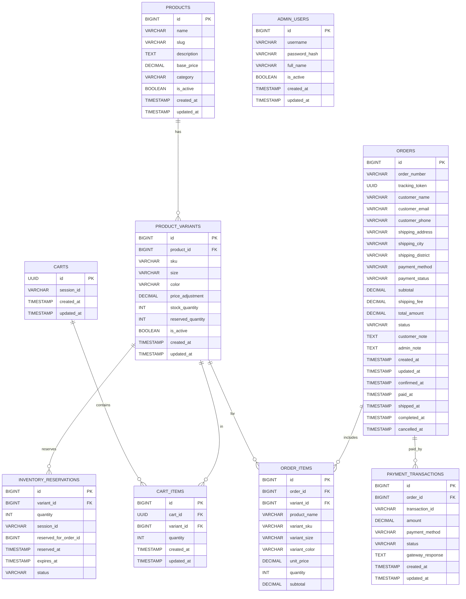
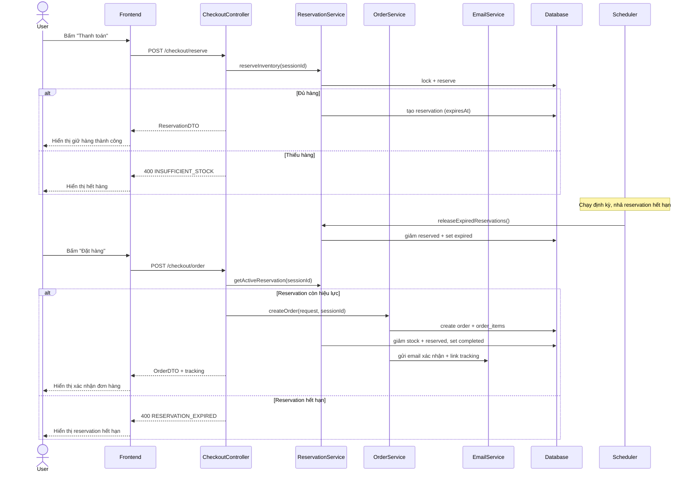
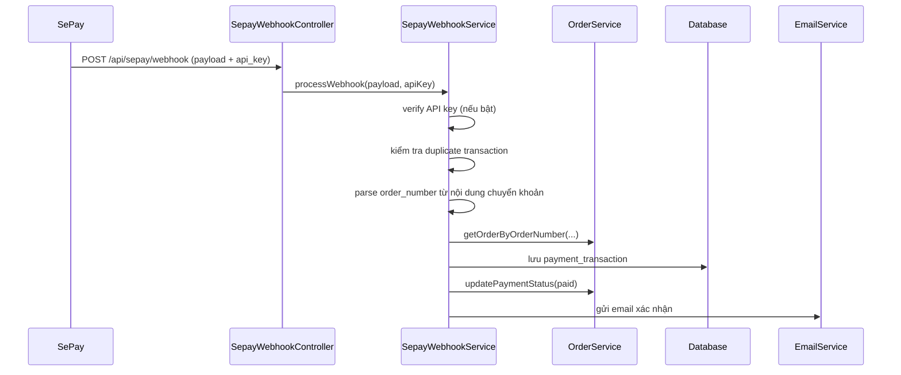

# BÁO CÁO KỸ THUẬT - HUNG HYPEBEAST E-COMMERCE

GitHub Repository: https://github.com/mthangtr/ecommerce-backend-system

## 1. ĐÁNH GIÁ SƠ BỘ & PHÂN TÍCH YÊU CẦU

### 1.1. Xác định Scope

#### Must-have (Phải làm trong 2 tuần)

| Tính năng | Mô tả | Ghi chú |
|-----------|-------|---------|
| **Catalog & SKU** | Quản lý sản phẩm với biến thể (size, màu sắc), hiển thị danh sách phân trang, lọc theo category và khoảng giá | Trong scope Phase 1 |
| **Shopping Cart** | Thêm/sửa/xóa sản phẩm, kiểm tra tồn kho trước khi thêm vào giỏ | Trong scope Phase 1 |
| **Inventory Reservation** | Giữ hàng 10-15 phút khi checkout, xử lý "last item" với database lock | Trong scope Phase 1 |
| **Checkout Flow** | Tạo đơn hàng với thông tin ship, hỗ trợ COD | Trong scope Phase 1 |
| **SePay Webhook Integration** | Tự động cập nhật trạng thái thanh toán khi nhận webhook | Trong scope Phase 1 |
| **Order Tracking** | Tracking đơn hàng qua link không cần đăng nhập, gửi email xác nhận | Trong scope Phase 1 |
| **Admin Order Management** | Xem danh sách đơn hàng, cập nhật trạng thái đơn và thanh toán | Trong scope Phase 1 |

#### Nice-to-have (Không bắt buộc trong Phase 1)

| Tính năng | Mô tả | Quyết định |
|-----------|-------|------------|
| **Admin Catalog CRUD** | API tạo/sửa/xóa sản phẩm | Bỏ qua (theo yêu cầu khách hàng - "chưa cần làm phần nhập liệu sản phẩm") |

### 1.2. Gap Analysis

#### Yêu cầu thô (Email khách hàng) vs Yêu cầu kỹ thuật thực tế

| Yêu cầu khách hàng | Thách thức kỹ thuật | Giải pháp triển khai |
|-------------------|---------------------|---------------------|
| "Giữ hàng 10-15 phút, người khác không mua được" | Race condition khi 2 người checkout cùng lúc cái cuối cùng | Pessimistic Lock (`findByIdWithLock`) + `reserved_quantity` tracking |
| "Hết giờ không trả tiền thì nhả ra" | Cần cơ chế tự động giải phóng reservation | Spring Scheduler chạy mỗi 1 phút, quét reservation hết hạn |
| "SePay tự động biết đơn nào đã trả tiền" | Webhook validation, xử lý duplicate, so khớp số tiền | Webhook `/api/sepay/webhook` + kiểm tra API key (tùy cấu hình), chống duplicate theo `transaction_id`, parse `ORD...` trong nội dung chuyển khoản, so khớp số tiền, cập nhật payment status |
| "Đừng bắt khách đăng nhập để xem đơn" | Bảo mật tracking token | UUID token trong URL, không lưu session |

#### Quyết định thiết kế quan trọng

**1. Inventory (Last item)**
- Dùng `reserved_quantity` + `PESSIMISTIC_WRITE` khi reserve/complete.
- Available stock = `stock_quantity - reserved_quantity`.

**2. Reservation Timeout**
- Mỗi reservation có `expires_at`.
- Scheduler chạy định kỳ để nhả hàng hết hạn, an toàn khi restart.

**3. Guest Session**
- Client gửi `X-Session-Id` (UUID) để quản lý cart.
- Tracking dùng `tracking_token` riêng, không phụ thuộc session.

### 1.3. Đánh giá Khả năng Hoàn thiện

#### Cam kết: 100% yêu cầu Must-have (Phase 1)

**Phạm vi cam kết:**
- Catalog với pagination, filtering, sorting
- Cart với stock validation
- Inventory reservation với pessimistic lock
- Checkout flow (COD)
- SePay webhook auto cập nhật payment status
- Email notification với tracking link
- Admin order management

**Phần đã cắt giảm / defer:**
- **Admin catalog CRUD** - Theo yêu cầu khách hàng, chưa cần trong Phase 1

**Cơ sở đánh giá khả năng hoàn thiện:**
- Scope Phase 1 tập trung COD + SePay webhook để tự động cập nhật payment status.
- Luồng inventory được thiết kế theo lock DB, không phụ thuộc hệ thống ngoài.

**Rủi ro & Mitigation:**

| Rủi ro | Mức độ | Giải pháp dự phòng |
|--------|--------|-------------------|
| Scheduler trễ 1 phút mới nhả hàng | Thấp | Acceptable - reservation 15 phút, trễ 1 phút không ảnh hưởng UX |
| Email gửi chậm/failed | Thấp | Retry theo cấu hình SMTP; nếu failed, xử lý thủ công |
| Database connection pool exhausted khi traffic cao | Cao | Cần load testing, tune connection pool size |

---

## 2. THIẾT KẾ HỆ THỐNG

### 2.1. Database Design (ERD)

#### 2.1.1. Bảng chính và quan hệ



#### 2.1.2. Giải thích các quyết định thiết kế quan trọng

**1. Tại sao tách `products` và `product_variants`?**

**Vấn đề nếu gộp chung:**
- Áo Thun Rồng có 6 variants (3 size × 2 màu) = 6 rows trùng tên/mô tả
- Thay đổi thông tin sản phẩm phải update nhiều rows
- Khó quản lý khi scale

**Giải pháp:**
- `products`: Thông tin chung (tên, mô tả, category, base_price)
- `product_variants`: SKU cụ thể (size, màu, price_adjustment, stock)

**Ví dụ thực tế:**
```
Product: Áo Thun Rồng (base_price: 299,000đ)
├─ Variant: Size M - Đen (SKU: AO-RONG-M-DEN, adjustment: 0)
├─ Variant: Size L - Đen (SKU: AO-RONG-L-DEN, adjustment: 20,000)
└─ Variant: Size XL - Trắng (SKU: AO-RONG-XL-TRANG, adjustment: 30,000)
```

---

**2. Tại sao cần `reserved_quantity` riêng?**

**Kịch bản race condition:**
```
Áo size L còn 1 cái:
14:00:00 - Khách A checkout (đang điền form)
14:00:01 - Khách B checkout (đang điền form)
14:00:30 - Khách A đặt hàng → Success
14:00:31 - Khách B đặt hàng → Success (OVERSELL!)
```

**Giải pháp với reservation:**
```sql
-- Available stock = stock_quantity - reserved_quantity
stock_quantity: 10
reserved_quantity: 3  (3 người đang checkout)
available: 7          (còn bán được)

-- Khi checkout: tăng reserved, tạo reservation (expires_at = +15 phút)
-- Khi đặt hàng: giảm stock + reserved, mark reservation completed
-- Khi hết hạn: giảm reserved, mark reservation expired (Scheduler tự động)
```

**Lock mechanism:**
- Dùng `@Lock(PESSIMISTIC_WRITE)` khi reserve/complete để tránh race condition
- Chỉ 1 transaction cập nhật tồn kho tại một thời điểm

---

**3. Tại sao cart dùng `session_id` thay vì `user_id`?**

**Requirement:** "Đừng bắt khách đăng nhập" - Guest checkout

**Flow:**
1. Client tạo UUID ngẫu nhiên, lưu `localStorage`, gửi qua header `X-Session-Id`
2. Backend tìm/tạo cart theo `session_id`
3. Giỏ hàng persist cho đến khi khách đặt hàng hoặc hết hạn

**Lợi ích:**
- Không cần authentication
- Giỏ hàng vẫn còn khi khách quay lại (trong vài ngày)
- Dễ dàng mở rộng: Sau này có user system, chỉ cần thêm `user_id` vào bảng `carts`

---

**4. Tại sao order tracking dùng `tracking_token` (UUID)?**

**Vấn đề nếu dùng order_id:**
```
URL: /track/12345 → Khách có thể đoán /track/12346, /track/12347
→ Xem được đơn hàng của người khác (Data leak)
```

**Giải pháp:**
```
tracking_token: UUID (128-bit random)
URL: /track/a1b2c3d4-e5f6-7890-abcd-ef1234567890
→ Không thể đoán được
```

**Email gửi khách:**
```
Mã đơn: ORD-20250108-00001
Tracking: https://shop.com/track/a1b2c3d4-...
→ Chỉ người có link mới xem được
```

---

**5. Tại sao snapshot product info vào `order_items`?**

**Kịch bản:**
```
Ngày 1: Khách mua "Áo Thun Rồng" - 299,000đ
Ngày 5: Admin đổi giá → 350,000đ
Ngày 10: Khách gọi: "Sao đơn em giá 350k, em mua lúc 299k mà?"
```

**Giải pháp:**
- Lưu snapshot: `product_name`, `variant_sku`, `variant_size`, `variant_color`, `unit_price`
- Giá trong đơn hàng **không bao giờ thay đổi**
- Sản phẩm bị xóa → đơn hàng vẫn hiển thị đầy đủ

**Lợi ích:**
- Audit trail hoàn chỉnh
- Legal compliance (cần cho kế toán, thuế)
- Tránh tranh chấp với khách hàng

---

### 2.2. Low-Level Design (LLD)

#### 2.2.1. API Endpoints

**Public APIs (Không cần authentication)**

| Method | Endpoint | Mô tả |
|--------|----------|-------|
| GET | `/api/products` | Lấy danh sách sản phẩm (phân trang, lọc, sort) |
| GET | `/api/products/{id}` | Chi tiết sản phẩm với variants |
| GET | `/api/cart` | Lấy giỏ hàng theo session |
| POST | `/api/cart/items` | Thêm item vào giỏ |
| PUT | `/api/cart/items/{itemId}` | Cập nhật số lượng item |
| DELETE | `/api/cart/items/{itemId}` | Xóa item khỏi giỏ |
| POST | `/api/checkout/reserve` | Giữ hàng trước khi thanh toán |
| GET | `/api/checkout/reservation` | Kiểm tra reservation hiện tại |
| DELETE | `/api/checkout/reservation` | Hủy reservation |
| POST | `/api/checkout/order` | Tạo đơn hàng |
| GET | `/api/orders/track/{token}` | Tracking đơn hàng (UUID token) |
| POST | `/api/sepay/webhook` | Nhận webhook từ SePay, cập nhật payment status |

**Admin APIs (Cần session authentication)**

| Method | Endpoint | Mô tả |
|--------|----------|-------|
| POST | `/api/admin/auth/login` | Đăng nhập admin |
| POST | `/api/admin/auth/logout` | Đăng xuất |
| GET | `/api/admin/orders` | Danh sách đơn hàng (phân trang, filter) |
| GET | `/api/admin/orders/{orderId}` | Chi tiết đơn hàng |
| PATCH | `/api/admin/orders/{orderId}/status` | Cập nhật trạng thái đơn |
| PATCH | `/api/admin/orders/{orderId}/payment-status` | Cập nhật trạng thái thanh toán (thủ công cho Phase 1) |

---

#### 2.2.2. Sequence Diagrams

**Diagram 1: Inventory Reservation & Checkout**



---

**Diagram 2: SePay Webhook Payment**



## 3. KẾT LUẬN

### Tóm tắt kết quả Phase 1

| Thành phần | Hoàn thành | Ghi chú |
|-----------|-----------|---------|
| Must-have features | **100%** | Catalog, Cart, Inventory, Checkout (COD + SePay), Tracking, Admin |
| SePay webhook | **100%** | Tự động cập nhật payment status qua webhook |
| Nice-to-have | **Deferred** | Admin Catalog CRUD |
| Database design | **100%** | Thiết kế bảng & quan hệ đầy đủ cho Phase 1 |
| API endpoints | **100%** | 18 APIs (12 public + 6 admin) |
| Email Service | **100%** | SMTP Gmail, gửi tracking link |
| Technical docs | **100%** | Report này + sequence diagrams |